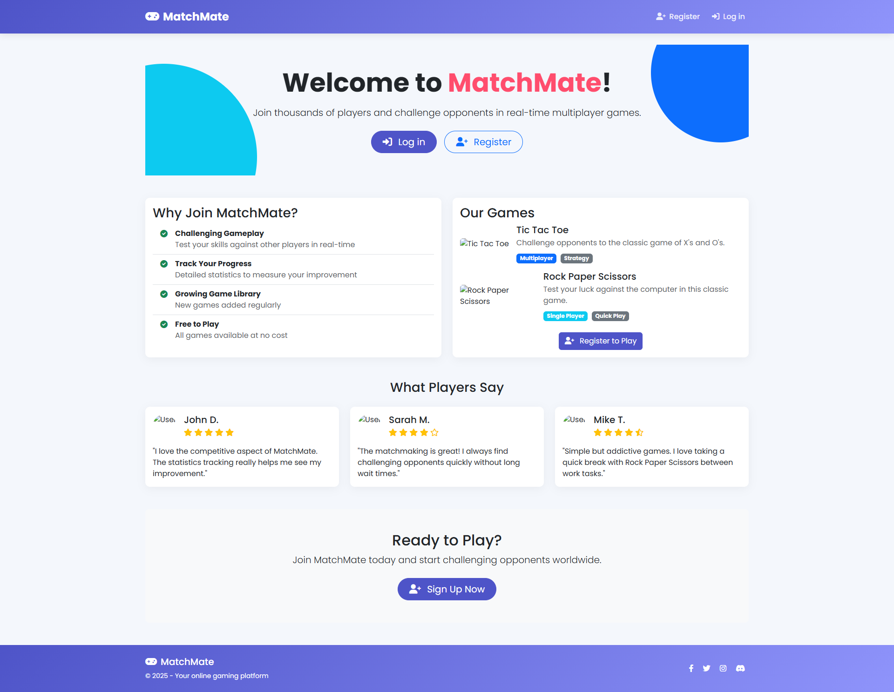
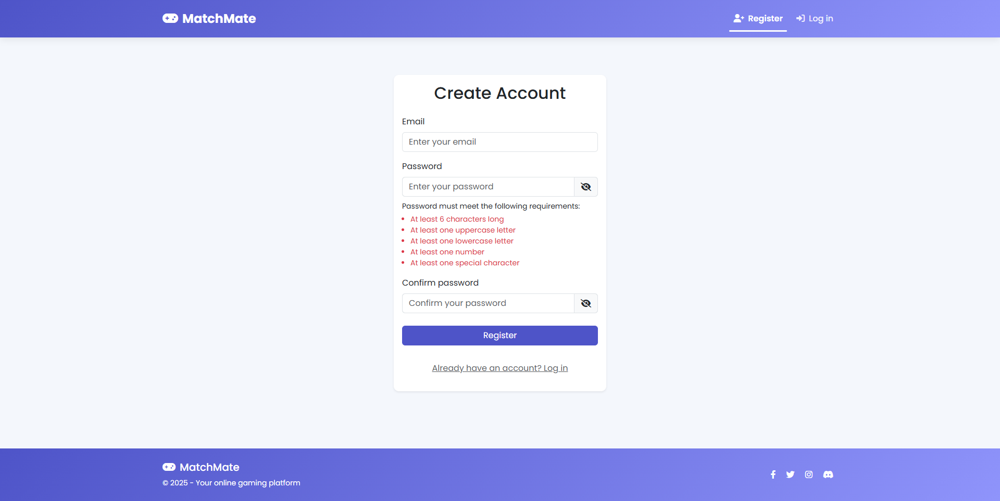
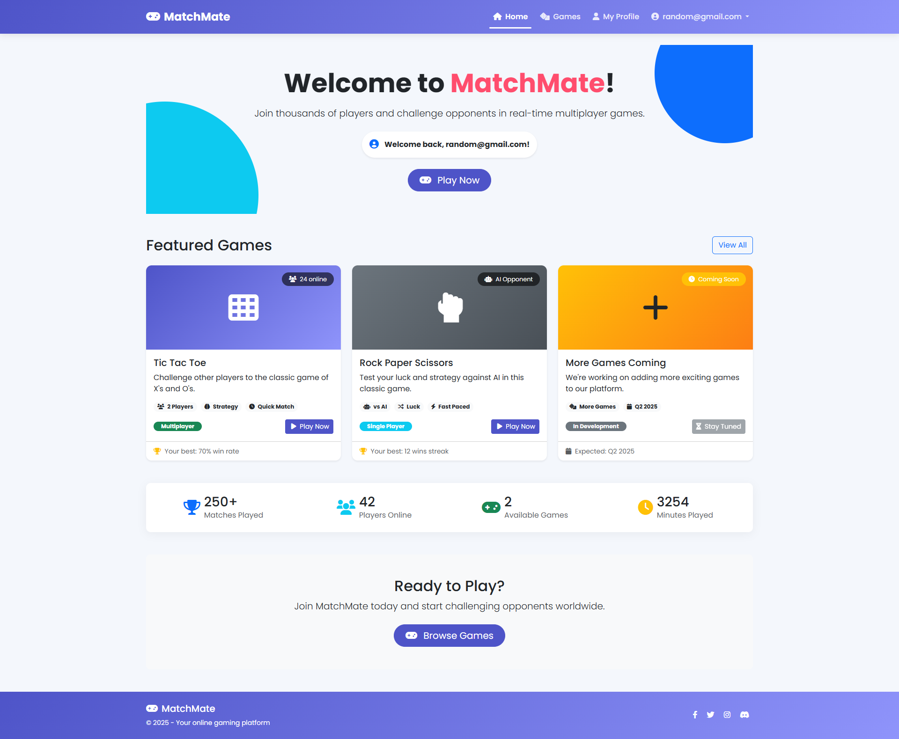
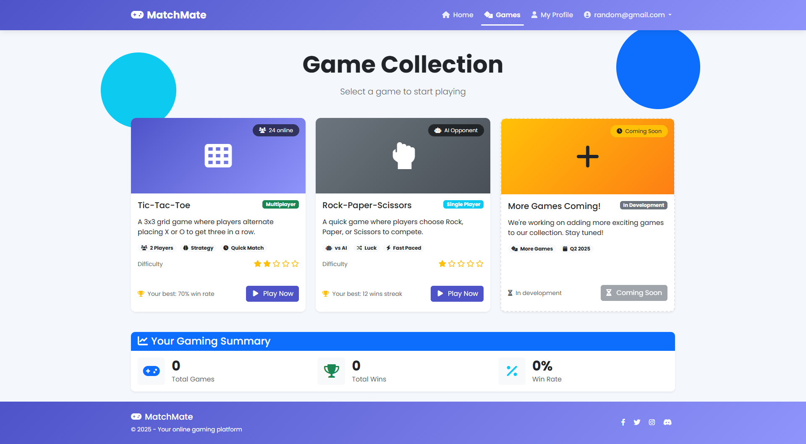
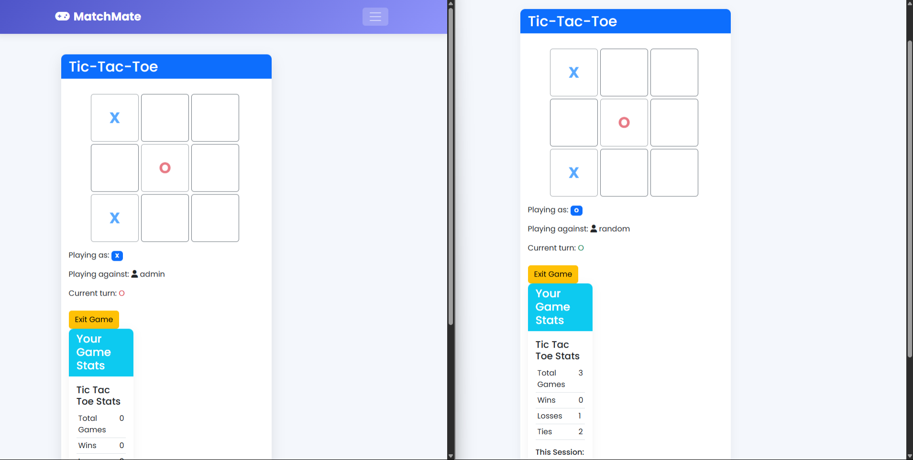
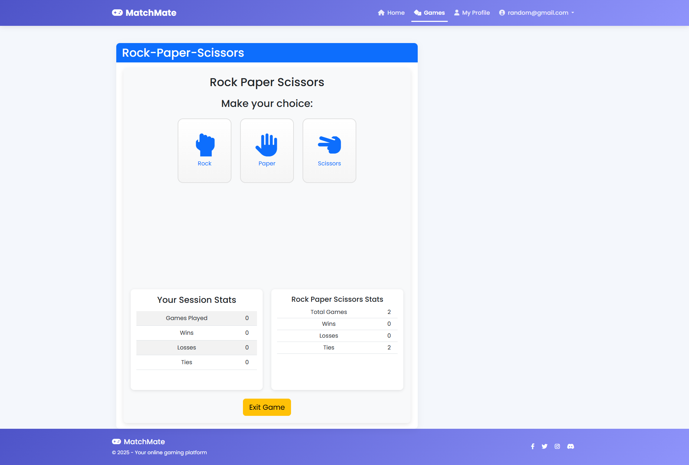
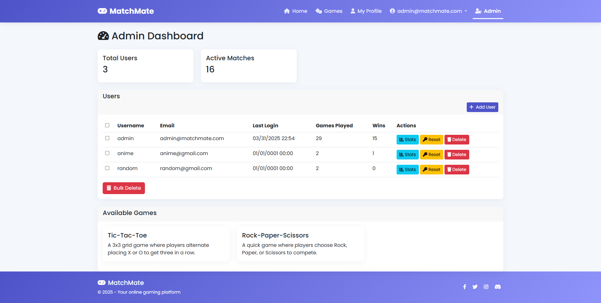

# MatchMate - Multiplayer Gaming Platform

Welcome to **MatchMate**, a web-based gaming platform where users can enjoy classic games like Tic-Tac-Toe and Rock-Paper-Scissors against other players or a computer opponent. This README provides instructions for setting up the project on your local machine after cloning the repository, configuring the database, applying migrations, using admin features, and understanding the application's output.

## Tools and Technologies
- **SignalR**: 
  - A key library for real-time web functionality, enabling live multiplayer gaming (e.g., Tic-Tac-Toe moves) between players. It uses WebSockets for bi-directional communication between the server and clients, ensuring seamless updates without page refreshes.
- **ASP.NET Framework**: 
  - Provides the backbone for the web application, handling routing, controllers, and views with MVC architecture.
- **Entity Framework**: 
  - An ORM (Object-Relational Mapping) tool for Code-First database management, used to create and manage the `MatchMateDB` schema and migrations.
- **SQL Server**: 
  - The database engine storing user data, game records, and match statistics.
- **ASP.NET Identity**: 
  - Manages user authentication, authorization, and roles (e.g., Admin vs. User).
- **NuGet Packages**: 
  - Used to manage dependencies like SignalR, Entity Framework, and others; restored automatically in Visual Studio.

## Project Structure
- **Controllers**:
  - `AdminController.cs`: Manages admin actions (e.g., dashboard, user management).
  - `GamesController.cs`: Handles game logic, matchmaking, and user statistics.
  - `AccountController.cs`: Controls user authentication (login, registration).

- **Models**:
  - `ApplicationUser.cs`: Defines the user model with properties like `Username` and `LastLoginTime`.
  - `Game.cs`: Represents available games (e.g., Tic-Tac-Toe, Rock-Paper-Scissors).
  - `Match.cs`: Tracks game matches, including players and outcomes.
  - `AdminViewModels.cs`: View models for admin-specific features.
  - `StatisticsViewModel.cs`: View model for displaying user game stats.

- **Views**:
  - `Admin/Dashboard.cshtml`: Renders the admin dashboard UI.
  - `Admin/UserStats.cshtml`: Displays individual user statistics.
  - `Games/Index.cshtml`: Shows the game selection page.
  - `Games/Statistics.cshtml`: Presents user game statistics.

- **Configuration**:
  - `Web.config`: Stores connection strings and application settings.
  - `IdentityConfig.cs`: Configures ASP.NET Identity and initializes the admin user.

## Prerequisites
ensure the following are installed:

- **Operating System**: Windows (recommended for SQL Server Management Studio compatibility).
- **.NET Framework**: Version 4.8 or higher.
- **Visual Studio**: 2019 or later (Community, Professional, or Enterprise edition).
- **SQL Server**: SQL Server 2019 or later (Express edition is sufficient).
- **SQL Server Management Studio (SSMS)**: Version 18 or later for database management.
- **Internet Browser**: Any modern browser (e.g., Chrome, Edge, Firefox) for testing.

## Setup Instructions

### Step 1: Install Required Software
1. **Install .NET Framework 4.8**:
   - Download the [.NET Framework 4.8 Developer Pack](https://dotnet.microsoft.com/download/dotnet-framework/net48) from Microsoft.
   - Run the installer and follow the prompts.
   - Verify with: `reg query "HKEY_LOCAL_MACHINE\SOFTWARE\Microsoft\NET Framework Setup\NDP\v4\Full" /v Version` (should return 4.8.xxxxx).

2. **Install Visual Studio**:
   - Download from [visualstudio.microsoft.com](https://visualstudio.microsoft.com).
   - Select workloads: **ASP.NET and web development** and **.NET desktop development**.
   - Complete installation and launch.

3. **Install SQL Server**:
   - Download [SQL Server Express](https://www.microsoft.com/en-us/sql-server/sql-server-downloads) from Microsoft.
   - Choose **Basic** installation and note the server name (e.g., `(localdb)\MSSQLLocalDB`).

4. **Install SSMS**:
   - Download from the [SSMS page](https://docs.microsoft.com/en-us/sql/ssms/download-sql-server-management-studio-ssms).
   - Run the installer and complete setup.

### Step 2: Clone the MatchMate Repository
1. **Clone the Repository**:
   - Open a terminal or command prompt.
   - Run: 
     ```bash
     git clone https://github.com/dhunganaPradeep/MatchMate.git
     ```
   - Navigate into the project folder:
     ```bash
     cd MatchMate
     ```
2. **Open the Solution**:
   - Launch Visual Studio.
   - Go to `File > Open > Project/Solution`.
   - Select `MatchMate.sln` from the cloned repository folder and open it.

### Step 3: Configure the Database
MatchMate uses a SQL Server database named `MatchMateDB`.

#### Create the Database in SSMS
1. Open SSMS and connect to your SQL Server instance (e.g., `(localdb)\MSSQLLocalDB`).
2. Right-click **Databases** > **New Database**.
3. Enter `MatchMateDB` as the name and click **OK**.
4. Verify `MatchMateDB` appears under **Databases**.

#### Update the Connection String
1. In Visual Studio, open `Web.config` in the project root (found in the cloned repository folder).
2. Update the `<connectionStrings>` section:
   ```xml
   <connectionStrings>
     <add name="DefaultConnection" 
          connectionString="Data Source=(localdb)\MSSQLLocalDB;Initial Catalog=MatchMateDB;Integrated Security=True;" 
          providerName="System.Data.SqlClient" />
   </connectionStrings>
   ```
   - Replace `Data Source` with your server name if different.
   - Use `Integrated Security=True` for Windows Authentication or add `User Id` and `Password` for SQL Server Authentication.
3. Save `Web.config`.

#### Import Data from `data.sql` (Fallback Option)
If the database setup or migrations fail:
1. Locate the `data.sql` file in the cloned repository folder (e.g., `MatchMate/data.sql`).
2. In SSMS, connect to your SQL Server instance.
3. Open the `data.sql` file: `File > Open > File` and select `data.sql`.
4. Ensure the database context is set to `MatchMateDB` (use the dropdown at the top of SSMS or run `USE MatchMateDB;`).
5. Execute the script: Press **F5** or click **Execute**.
6. Verify the tables (e.g., `dbo.AspNetUsers`, `dbo.Games`, `dbo.Matches`) and data are created in `MatchMateDB`.

### Step 4: Apply Entity Framework Migrations
1. In Visual Studio: `Tools > NuGet Package Manager > Package Manager Console`.
2. Enable migrations (if not already done): `Enable-Migrations`.
3. If the `Migrations` folder is empty, add an initial migration: `Add-Migration InitialCreate`.
4. Apply migrations: `Update-Database`.
5. In SSMS, verify tables like `dbo.AspNetUsers`, `dbo.Games`, `dbo.Matches` exist in `MatchMateDB`.

### Step 5: Set Up the Admin User
The admin user is created on the first run via `RoleInitializer` in `IdentityConfig.cs`.
1. Verify in `IdentityConfig.cs` (in the cloned repository folder):
   ```csharp
   string adminEmail = "admin@matchmate.com";
   string adminPassword = "Admin@321";
   ```
   - Admin credentials: **Email**: `admin@matchmate.com`, **Password**: `Admin@321`, **Role**: `Admin`.
2. Run the app (F5) to trigger initialization.
3. In SSMS, confirm with: `SELECT UserName, Email FROM dbo.AspNetUsers WHERE Email = 'admin@matchmate.com'`.

### Step 6: Build and Run the Application
1. In Solution Explorer, right-click `MatchMate` > **Set as Startup Project**.
2. Build: `Build > Build Solution` (Ctrl+Shift+B).
3. Run: Press F5 (launches at `http://localhost:xxxx/`).
4. Log in as admin: `/Account/Login` with `admin@matchmate.com` and `Admin@321`.

### Step 7: Explore Admin Features
- **Admin Dashboard**: `/Admin/Dashboard`
  - View users, total games, active matches.
- **Admin Actions**:
  - Add user: Fill email/password fields.
  - Delete user: Select and confirm deletion.
  - Bulk delete: Check multiple users and confirm.
  - View stats: Per-user game breakdowns.
  - Change admin password: Update via `/Admin/ChangePassword`.
  - Reset user password: Resets to `NewPassword123!`.

### Step 8: Play Games as a Regular User
1. Register: `/Account/Register` (e.g., `player1@example.com`, `Player@123`).
2. Play: `/Games/Index` > Select a game > **Play**.
3. Stats: `/Games/Statistics` for game history.

## Output
1) Home Page

2) registering new user

3) Home Page after Login

4) Game Page

5) 2 players playing tic-tac-toe in real time

6) Rock Paper Scissior Game

7) Admin Panel



## Troubleshooting
- **Database Connection Issues**:
  - Check `Web.config` connection string and ensure SQL Server is running (`services.msc`).
  - If migrations fail or the database isn’t created, use the `data.sql` file:
    - Open in SSMS, set context to `MatchMateDB`, and execute (F5).
    - Verify tables and data are populated.
- **Migration Errors**: Use `Update-Database -Verbose` or recreate the database and re-run migrations.
- **Admin Login Fails**: Verify `AspNetUsers` table and reset password if needed.
- **Build Errors**: Restore NuGet packages (`Tools > NuGet Package Manager > Restore NuGet Packages`).

